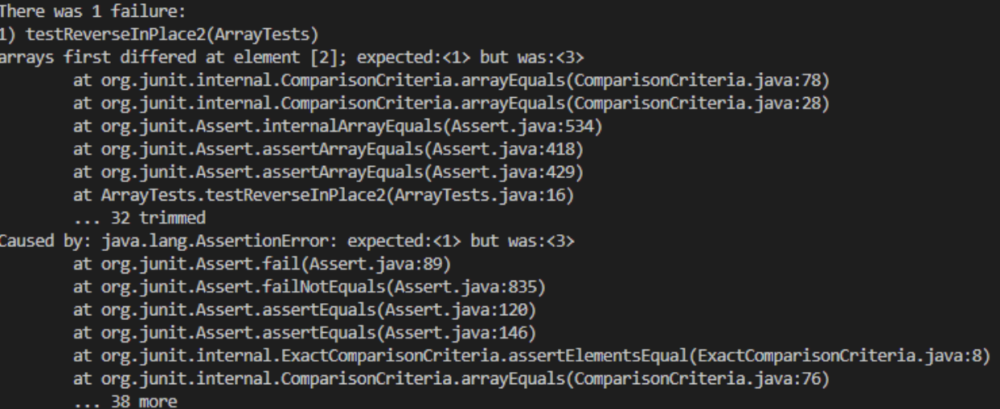

# Lab Report 2 
## **String Server Code:**


### **Examples** 


## **Part 2: A Bug** 
#### The code snippet from lab 3. 
```java
public class ArrayExamples{
   static void reverseInPlace(int[] arr){
      for(int i = 0; i < arr.length; i += 1){
      arr[i] = arr[arr.length - i - 1]; 
      }
   }
}
```

#### **An input that doesn’t induce a failure, as a JUnit test and any associated code**
```java
int[] input1 = { 3 };
ArrayExamples.reverseInPlace(input1);
assertArrayEquals(new int[]{ 3 }, input1); 
```

#### **A failure-inducing input**
```java
int[] input2 = {1, 2, 3};
ArrayExamples.reverseInPlace(input2);
assertArrayEquals(new int[]{2, 2, 1}, input2); 
```


The problem with this method is that the first element is being replaced by the last element, making the original value being lost. Hence, making the first and last element be the same value. 

#### **Fixing the Bug**
```java
static void reverseInPlace(int[] arr) {
   int[] newArray = new int[arr.length];
   for(int i = 0; i < arr.length; i += 1) {
     newArray[i] = arr[i];
   }
   for(int i = 0; i < arr.length; i += 1) {
     arr[i] = newArray[arr.length - i - 1];
   }
}
 ```

